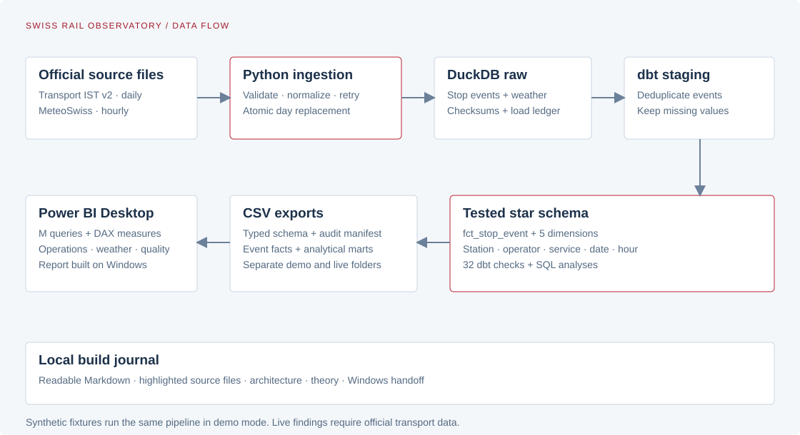

# Swiss Rail Observatory

An independent operations analytics warehouse for eight Swiss rail hubs. Python loads transport and hourly weather files, dbt builds a tested star schema in DuckDB, and typed exports feed a Power BI report.

The business question is practical: **which stations and scheduled hours deserve investigation, and how do reliability patterns differ with weather?**



## Current status

- The 90-day synthetic demo runs end to end and produces 25,920 deduplicated stop events.
- The first complete demo passes 32 dbt data tests. Python tests check timestamp boundaries, retries, corrections, and metric results.
- Real MeteoSwiss observations have been loaded locally for eight stations. Live transport downloads were denied by the provider in this environment. No demo values are presented as live findings.
- The three-page Power BI demo report was built in Desktop on Windows. The author confirmed the expected totals and station/date filter checks; screenshots and `powerbi/report/report.pbix` are saved locally.

## Power BI report

The report covers 1 June to 29 August 2026 using synthetic demonstration data. The author built it in Power BI Desktop and confirmed the metric and filter checks. These screenshots demonstrate the report, not real Swiss railway performance.

### Operations overview

Station comparisons, daily punctuality, cancellation rate, and P90 delay, with station/date filters.


### Weather and delays

Weather-group comparisons include arrival counts and measurement coverage. The weather trends repeat because the synthetic generator uses fixed cycles; they are not realistic weather history. Temperature spikes reflect deliberately missing observations.


### Data quality

Arrival coverage, measured share, and a comparison of default and measured-only punctuality help explain which records support the results.


Download [report.pbix](powerbi/report/report.pbix) and open it in Power BI Desktop. The [demo release](https://github.com/glebhimself/swiss-rail-observatory/releases/tag/v0.1.0) includes the synthetic CSV exports, Power Query imports, DAX definitions, PBIX, and screenshots. To refresh on another Windows machine, update the report's `ExportFolder` query to that machine's extracted `exports/demo` folder.

The author confirmed the unfiltered totals and the Zürich HB / 1 June filter check: 36 stop events, 34 eligible arrivals, and 61.76% on time. Screenshots show default metrics; Desktop filter behavior was manually checked by the author.

## Run the warehouse

Use Python 3.11, 3.12, or 3.13. The tested interpreter is Python 3.12. Python 3.14 is excluded by the package metadata.

```bash
python3.12 -m venv .venv
source .venv/bin/activate
pip install -r requirements.lock
pip install --no-deps -e .
rail demo
pytest -q
```

The demo takes a few seconds after installation. Inputs, warehouse, and outputs are isolated under `data/demo/` and `exports/demo/`. The synthetic generator has a fixed random seed. It is a reproducibility fixture, not a source of business conclusions.

With Docker Desktop running:

```bash
docker compose run --build --rm warehouse
```

Docker writes the same outputs into the repository's `data/` and `exports/` directories.

## Use official data

```bash
rail --mode live sync --start 2026-06-01 --end 2026-08-29
rail --mode live build
rail --mode live export
```

The catalog contains a rolling set of daily files. Dates outside its available range are reported as missing. Older dates require the official archive, imported as a monthly ZIP or dated daily CSV:

```bash
rail --mode live ingest --start 2026-06-01 --end 2026-08-29 \
  --transport-file /path/to/official-month.zip
rail --mode live sync --source weather --start 2026-06-01 --end 2026-08-29
rail --mode live build
rail --mode live export
```

A failed or incomplete sync exits nonzero and records the missing days. Previously completed partitions remain available. Use `--refresh` to recheck published transport corrections. Run one warehouse writer at a time.

## Project map

| Folder | What it contains |
|---|---|
| `src/swiss_rail/` | Ingestion, schema normalization, transaction ledger, CLI, dbt orchestration |
| `dbt/` | Sources, station seed, dimensions, fact table, analytical marts, tests and analyses |
| `powerbi/` | Typed M queries, DAX measures, theme, and the completed PBIX report |
| `docs/` | Architecture diagram and report screenshots |
| `tests/` | Offline tests with HTTP mocks and a real DuckDB/dbt integration test |
| `.github/workflows/` | Warehouse and Docker checks |

## Metrics and limits

Arrival punctuality means less than 180 seconds late among eligible recorded arrivals. It excludes cancelled stops, extra services, pass-through records, missing times, unknown statuses, and unresolved timestamp ambiguity. REAL, PROGNOSE, and GESCHAETZT are included but distinguishable. A measured-only sensitivity analysis is supplied.

Cancellation rate counts recorded scheduled stop events, not entire journeys. Missing journeys in the source cannot be reconstructed from IST data alone. Weather comes from regional stations, and comparisons describe associations rather than causation. This project does not estimate passenger-weighted punctuality or connection success.

Arrival coverage is eligible arrivals divided by recorded expected arrivals. Measured share is REAL-status eligible arrivals divided by all eligible arrivals. Weather coverage requires a non-null precipitation measurement. P90 is calculated from eligible event-level delays, rather than averaged daily percentiles.

## Data attribution

Transport source: [opentransportdata.swiss](https://opentransportdata.swiss/), subject to its [terms of use](https://opentransportdata.swiss/de/terms-of-use/).

Source: [MeteoSwiss](https://opendatadocs.meteoswiss.ch/), with [data download documentation](https://opendatadocs.meteoswiss.ch/general/download).

Synthetic demo data is generated by this repository. Code licensing has not yet been selected by the repository owner. Source-data terms are separate from the code license.
